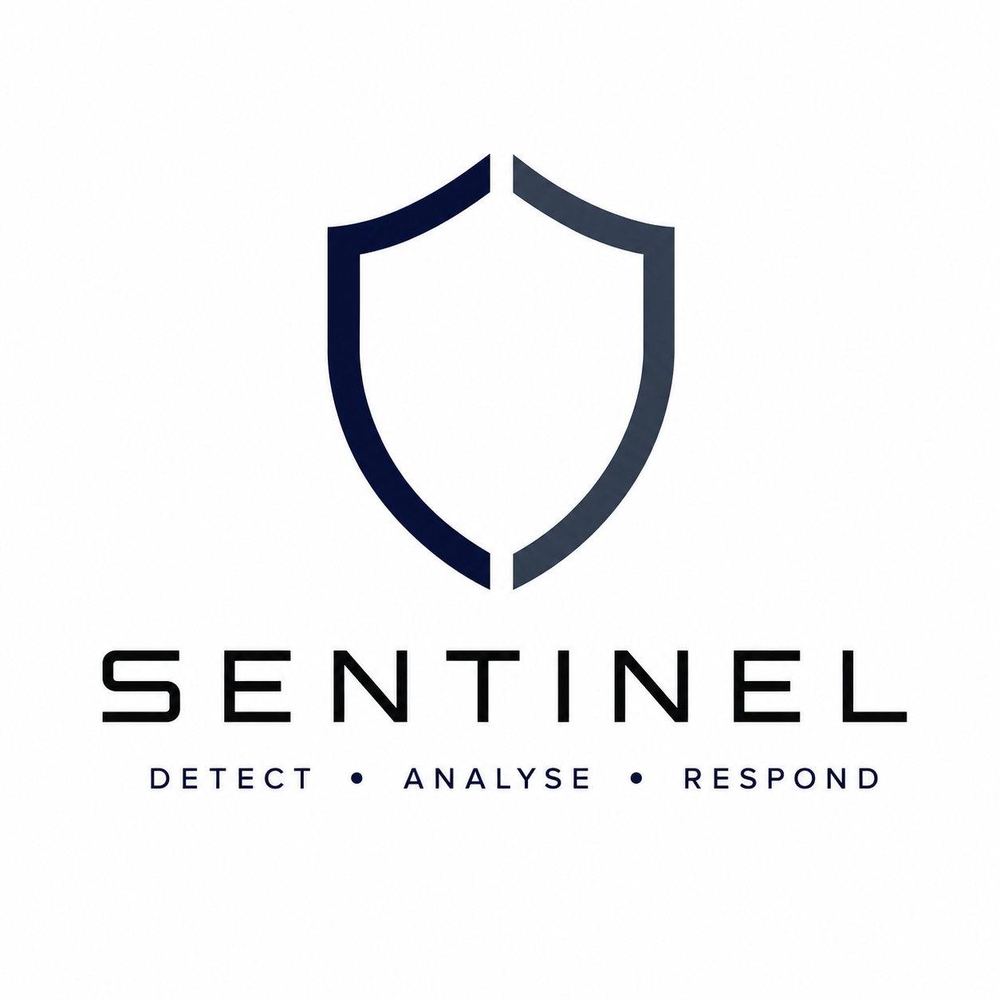
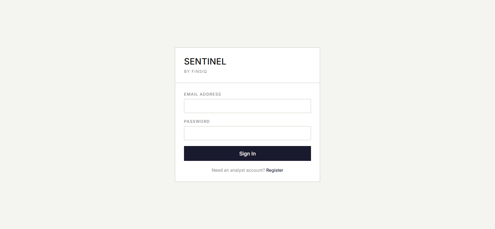
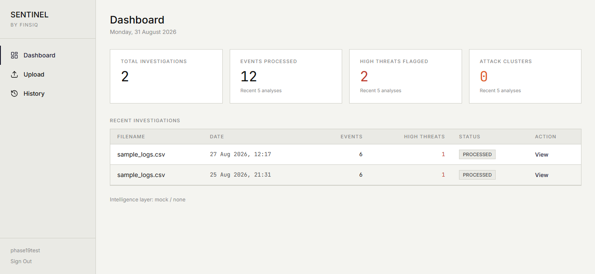
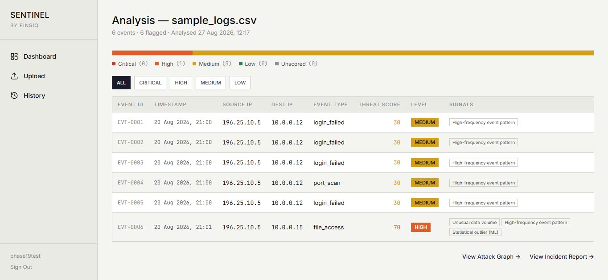
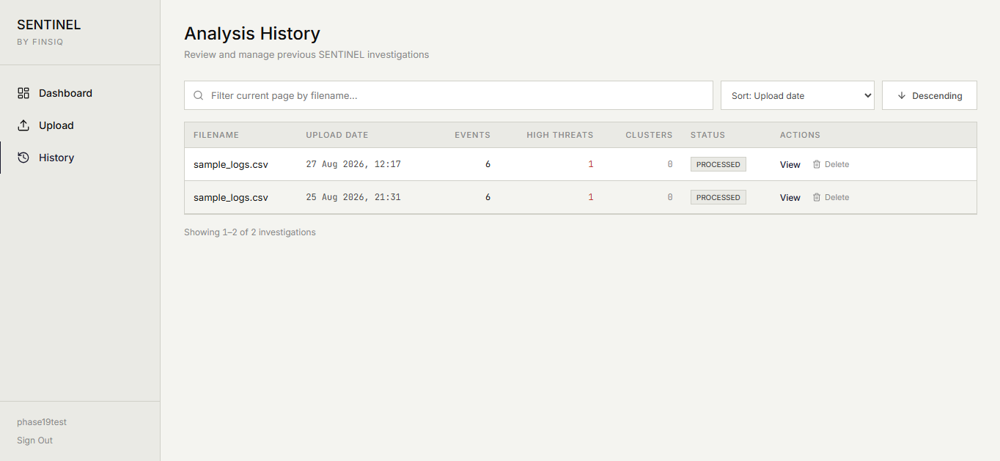

<div align="center">



# SENTINEL

**Enterprise Cyber Intelligence Platform**

*Detect · Analyse · Respond*


[**Live Demo**](https://sentinel-rho-ruby.vercel.app/) · [**API
Health**](https://sentinel-api-mf0t.onrender.com/api/health) ·
[**Repository**](https://github.com/darrylchikamba/sentinel)

</div>

------------------------------------------------------------------------

## Overview

Security telemetry is easy to collect and difficult to turn into a
defensible decision.

**SENTINEL by FINSIQ** is a full-stack cyber intelligence platform that
converts uploaded security events into an investigation workflow:
ingestion, deterministic threat analysis, attack-graph construction,
South African regulatory signal detection, retrieval-augmented context,
and a grounded incident report produced by **BONA**, SENTINEL's AI
reporting layer.

The project is built around one principle:

> **AI may explain evidence. It must not invent it.**

Deterministic analysis establishes the facts first. Generative AI
operates downstream of that evidence, with shared post-generation
validation enforcing MITRE ATT&CK formatting, RAG provenance and a
stable report contract.

SENTINEL is deliberately South Africa-aware. Its investigation pipeline
can surface signals relevant to **POPIA** and the **Cybercrimes Act**,
alongside MITRE ATT&CK-aligned technical findings.

------------------------------------------------------------------------

## Live Deployment

  ---------------------------------------------------------------------------------------------------------------------------
  Service                 Platform                URL
  ----------------------- ----------------------- ---------------------------------------------------------------------------
  Frontend                Vercel                  [sentinel-rho-ruby.vercel.app](https://sentinel-rho-ruby.vercel.app/)

  Backend API             Render                  [sentinel-api-mf0t.onrender.com](https://sentinel-api-mf0t.onrender.com/)

  Health check            Render                  [/api/health](https://sentinel-api-mf0t.onrender.com/api/health)

  Database                MongoDB Atlas           Managed cloud deployment
  ---------------------------------------------------------------------------------------------------------------------------

> **Cold-start note:** the portfolio backend runs on Render's free tier
> and may take roughly 30--60 seconds to wake after inactivity.

### Production AI mode

The public deployment intentionally uses:

``` env
AI_GENERATION_PROVIDER=mock
AI_EMBEDDING_PROVIDER=none
```

The free deployment does not host local Ollama inference or the local
ChromaDB service. Production RAG is therefore unavailable by design, and
BONA's grounding layer forces `rag_sources_used` to an empty list when
no retrieval context exists.

The complete Ollama + ChromaDB pipeline remains available in the local
Docker environment.

------------------------------------------------------------------------

## Investigation Pipeline

``` text
Security Telemetry
       │
       ▼
┌─────────────────────┐
│  Upload & Validate  │  CSV / XLSX / XLS
└──────────┬──────────┘
           ▼
┌─────────────────────┐
│ Deterministic       │  threat scores · patterns
│ Analysis            │  indicators · regulatory flags
└──────────┬──────────┘
           ▼
┌─────────────────────┐
│ Attack Graph        │  entities · relationships · clusters
└──────────┬──────────┘
           ▼
┌─────────────────────┐
│ RAG Context         │  local ChromaDB knowledge base
└──────────┬──────────┘
           ▼
┌─────────────────────┐
│ BONA                │  grounded incident reporting
└──────────┬──────────┘
           ▼
┌─────────────────────┐
│ Incident Report     │  summary · MITRE · actions · provenance
└─────────────────────┘
```

### Investigation Dashboard

A scoped view of investigation activity, threat distribution and recent
investigations without presenting page-local statistics as global
metrics.

### Upload & Analysis

Telemetry is validated server-side before entering the pipeline.
SENTINEL accepts CSV and Excel formats, enforces file-size and raw-text
limits, sanitises filenames and rejects obvious binary content
masquerading as CSV.

### Interactive Attack Graph

SENTINEL persists the actual topology produced by the backend and
renders those nodes and edges with D3. Legacy investigations without
persisted topology report that graph data is unavailable rather than
fabricating relationships.

### Incident Reporting

BONA transforms deterministic investigation output into an
analyst-facing report containing an incident summary, exactly four
recommended actions, evidence-supported MITRE ATT&CK techniques,
relevant South African regulatory indicators, and RAG provenance only
when retrieval context genuinely exists.

### Investigation History

Analysts can revisit prior investigations, inspect reports and delete
investigations while preserving accurate pagination state.

------------------------------------------------------------------------

## Screenshots

Add the final production screenshots under `assets/screenshots/`:

  -----------------------------------------------------------------------------------------
  Login                                    Dashboard
  ---------------------------------------- ------------------------------------------------
     

  -----------------------------------------------------------------------------------------

  --------------------------------------------------------------------------------------------
  Analysis                                       Attack Graph
  ---------------------------------------------- ---------------------------------------------
     

  --------------------------------------------------------------------------------------------

  ----------------------------------------------------------------------------------------------
  Incident Report                                   History
  ------------------------------------------------- --------------------------------------------
  
  Report](assets/screenshots/incident-report.png)   

  ----------------------------------------------------------------------------------------------

------------------------------------------------------------------------

## Core Intelligence

### Deterministic Threat Analysis

Structured security events are evaluated before any generative model is
involved. Scoring, counts, graph topology and regulatory flags remain
reproducible and testable.

### Attack-Graph Intelligence

NetworkX-backed analysis turns event relationships into persisted graph
topology. Nodes retain threat level, event count and suspicious status;
edges capture event frequency, byte volume, dominant event type and
maximum threat score. D3 handles interactive visualisation while the
backend remains the source of truth.

### BONA --- Grounded Incident Intelligence

BONA is SENTINEL's reporting layer. Provider abstraction supports mock,
Ollama and Gemini generation without coupling the application to one
model provider.

The shared validation path used by Ollama and Gemini: - validates
leading MITRE IDs against `T####` / `T####.###`; - preserves descriptive
technique strings rather than changing the API shape; - removes invalid
technique entries; - clears claimed RAG provenance when RAG was
unavailable; - enforces exactly four next steps; and - prevents
provider-specific grounding logic from drifting.

### Retrieval-Augmented Generation

For the full local stack, ChromaDB provides retrieval over the SENTINEL
knowledge base. Retrieved intelligence context is supplied to BONA,
which is instructed to cite only sources present in that context. If
retrieval is unavailable, SENTINEL degrades honestly rather than
inventing provenance.

### South African Regulatory Context

The deterministic pipeline can surface indicators associated with South
African cyber and data-protection obligations, including POPIA and
Cybercrimes Act-related signals. These are investigation aids, not legal
determinations.

------------------------------------------------------------------------

## Architecture

``` text
┌──────────────────────────────────────────────────────────┐
│                    SENTINEL CLIENT                       │
│                 React 18 + Vite                          │
│ Auth · Dashboard · Analysis · D3 Graph · Reports        │
│                     Vercel                               │
└─────────────────────────┬────────────────────────────────┘
                          │ HTTPS / Axios / JWT
                          ▼
┌──────────────────────────────────────────────────────────┐
│                     FASTAPI API                          │
│                    Python 3.12                           │
│ Auth · Upload · Analysis · Incident · KB · Rate Limits  │
│ Input Validation · Payload Caps · Security Headers       │
│                     Render                               │
└───────────────┬───────────────────┬──────────────────────┘
                │                   │
                ▼                   ▼
       ┌────────────────┐   ┌───────────────────────┐
       │ MongoDB Atlas  │   │ Intelligence Pipeline │
       │ Users / Cases  │   │ scoring · graph · SA  │
       │ Reports        │   │ regulatory indicators │
       └────────────────┘   └───────────┬───────────┘
                                        │
                          ┌─────────────┴─────────────┐
                          ▼                           ▼
                 ┌────────────────┐          ┌────────────────┐
                 │ ChromaDB / RAG │          │      BONA      │
                 │  Local Docker  │          │ Mock / Ollama  │
                 │                │          │    / Gemini    │
                 └────────────────┘          └────────────────┘
```

------------------------------------------------------------------------

## Technology Stack

  -----------------------------------------------------------------------
  Layer                   Technology              Role
  ----------------------- ----------------------- -----------------------
  Backend                 Python 3.12             Core server runtime

  API                     FastAPI, Uvicorn        REST API and ASGI
                                                  serving

  Validation              Pydantic                Typed request
                                                  validation

  Database                MongoDB Atlas, PyMongo  Users, investigations
                                                  and reports

  Authentication          JWT, Passlib/Bcrypt     Stateless authenticated
                                                  API access

  Analysis                pandas, scikit-learn    Data processing and
                                                  analytical pipeline

  Graph                   NetworkX                Attack-graph
                                                  construction and
                                                  analysis

  RAG                     ChromaDB                Local vector knowledge
                                                  store

  AI                      Mock / Ollama / Gemini  Provider-abstracted
                                                  report generation

  Frontend                React 18, Vite          Single-page application

  Visualisation           D3.js                   Interactive attack
                                                  graph

  HTTP                    Axios                   Authenticated API
                                                  communication

  Containers              Docker, Docker Compose  Reproducible local
                                                  backend/RAG stack

  CI/CD                   GitHub Actions          Automated verification
                                                  and deployment

  Hosting                 Render, Vercel          Backend and frontend
                                                  hosting
  -----------------------------------------------------------------------

------------------------------------------------------------------------

## Security Engineering

### Authentication & authorisation

-   JWT authentication.
-   User-owned investigation queries include `user_id` to protect
    against IDOR.
-   ObjectId values are validated before database access.
-   Email normalisation, username constraints and password minimum
    length are enforced.

### Input & payload controls

-   `.csv`, `.xlsx` and `.xls` upload allow-list.
-   10 MB server-side upload cap.
-   50,000-character raw-text cap.
-   Safe-basename filename handling.
-   Obvious non-CSV binary content rejection.
-   1 MB JSON body cap.
-   Typed and bounded pagination/query parameters.
-   Bounded RAG `top_k`.
-   Constrained KB provider selection.

### HTTP controls

-   CORS restricted to the configured frontend origin.
-   Explicit allowed methods and headers.
-   `X-Content-Type-Options: nosniff`.
-   `X-Frame-Options: DENY`.
-   SlowAPI rate limiting.

### NoSQL boundary

SENTINEL does **not** claim that Pydantic provides SQL-style
parameterised queries. Its protection boundary is typed scalar
validation combined with application-defined MongoDB query fields; raw
user-supplied query objects are not passed directly to MongoDB.

------------------------------------------------------------------------

## BONA Grounding Guarantees

Generative output is treated as untrusted until validated.

``` text
Provider output
      │
      ▼
JSON parsing / contract validation
      │
      ├──► MITRE prefix validation
      ├──► RAG provenance enforcement
      ├──► four-step action contract
      ▼
Validated incident report
```

Prompt-level rules reinforce the same boundary: 1. When RAG is
unavailable, return no RAG sources. 2. Cite only intelligence sources
contained in supplied retrieval context. 3. Include only
evidence-supported MITRE technique IDs. 4. Do not invent attack
techniques, threat actors or intelligence sources.

The post-generation validator remains authoritative even if a model
ignores those instructions.

------------------------------------------------------------------------

## Testing & Quality Gates

``` text
Backend test suite:   234 / 234 passing
Failures:             0
Warnings:             0

Frontend build:       passing
npm audit:            0 vulnerabilities
Production smoke:     passing
```

Production smoke path:

``` text
Register → Login → Upload → Analysis → Attack Graph
         → Incident Report → History → Logout / Login
```

GitHub Actions runs backend verification on pushes to `main`. A
successful workflow triggers the Render deployment hook, while Vercel
deploys the frontend from the repository.

------------------------------------------------------------------------

## Local Development

### Prerequisites

-   Python 3.12
-   Node.js / npm
-   Docker Desktop + Docker Compose
-   MongoDB Atlas access
-   Optional: Ollama for local inference

### Clone

``` bash
git clone https://github.com/darrylchikamba/sentinel.git
cd sentinel
```

### Backend environment

Create `server/.env` from `server/.env.example`.

``` env
MONGO_URI=your_mongodb_connection_string
JWT_SECRET=your_long_random_secret
FRONTEND_URL=http://localhost:5173

AI_GENERATION_PROVIDER=mock
AI_EMBEDDING_PROVIDER=none
SENTINEL_EMBEDDING_DIM=768

CHROMA_HOST=chromadb
CHROMA_PORT=8000
OLLAMA_HOST=host.docker.internal
OLLAMA_PORT=11434
```

If Gemini is selected for generation or embeddings:

``` env
GEMINI_API_KEY=your_google_ai_api_key
```

### Frontend environment

Create `client/.env`:

``` env
VITE_API_URL=http://localhost:8000
```

### Run

Backend stack:

``` bash
docker compose up --build
```

Frontend, in another terminal:

``` bash
cd client
npm install
npm run dev
```

Open `http://localhost:5173` and verify the API at
`http://localhost:8000/api/health`.

### Quality checks

``` bash
docker compose exec api pytest
```

``` bash
cd client
npm run build
npm audit
```

------------------------------------------------------------------------

## Deployment

### Render backend

``` text
Dockerfile:       ./Dockerfile
Build context:    repository root
Container port:   8000
Health check:     /api/health
```

### Vercel frontend

``` text
Root directory:   client
Framework:        Vite
Build command:    npm run build
Output directory: dist
```

``` env
VITE_API_URL=https://sentinel-api-mf0t.onrender.com
```

Render's `FRONTEND_URL` is locked to the production Vercel origin.

### CI/CD

``` text
Push to main
     │
     ▼
GitHub Actions
     │
     ├──► Backend tests
     │
     └──► Pass
              │
              ▼
        Render deploy hook

Vercel ← GitHub main
```

------------------------------------------------------------------------

## Engineering Challenges & Decisions

### Persisting Real Graph Topology

**Problem:** counts can describe a graph statistically but cannot
reproduce its relationships.

**Decision:** persist the complete backend-generated `graph_result`.
Legacy investigations without topology show "graph data unavailable"
rather than reconstructed connections.

**Principle:** visualisation represents evidence; it does not
manufacture it.

### Shared BONA Grounding

**Problem:** grounding separately inside Ollama and Gemini would
duplicate security-sensitive logic.

**Decision:** centralise post-generation cleaning in the shared report
validation path.

**Principle:** every provider is held to the same contract.

### MITRE Validation Without Breaking the API

**Problem:** reports contain strings such as
`T1110.001 (Brute Force: Password Guessing)`, while grounding must
validate technique IDs.

**Decision:** validate the leading ID while preserving the complete
descriptive string.

**Principle:** improve grounding without silently changing the response
shape.

### Honest RAG Degradation

**Problem:** the free public environment cannot host the complete local
ChromaDB/Ollama stack.

**Decision:** disable embeddings in production and enforce empty
provenance when retrieval is unavailable.

**Principle:** unavailable intelligence is better represented as
unavailable than fabricated.

### Deletion & Pagination Consistency

**Problem:** deleting only from frontend state can leave totals and
last-page navigation incorrect.

**Decision:** delete server-side, decrement the page when necessary,
then refetch.

**Principle:** the UI remains a projection of server state.

------------------------------------------------------------------------

## Design Principles

1.  **Deterministic before generative** --- establish evidence before
    asking AI to explain it.
2.  **Grounding over completeness** --- an empty field is better than a
    fabricated answer.
3.  **Backend as source of truth** --- visualise persisted analysis
    rather than reconstructing it.
4.  **Security at boundaries** --- validate identities, inputs,
    payloads, ownership and model output.
5.  **Graceful degradation** --- optional AI/RAG infrastructure may
    disappear without breaking the core workflow.

------------------------------------------------------------------------

## Current Limitations

-   Public production uses mock BONA generation rather than hosted LLM
    inference.
-   ChromaDB-backed RAG is available locally but not on the free Render
    deployment.
-   Regulatory signals are analyst aids, not legal advice or definitive
    breach-reporting determinations.
-   SENTINEL analyses uploaded telemetry; it is not currently a live
    SIEM ingestion service.
-   The public deployment is intended for portfolio demonstration rather
    than production SOC workloads.

------------------------------------------------------------------------

## Roadmap

-   Hosted production RAG/vector infrastructure.
-   Live Gemini-backed BONA generation for the public deployment.
-   Streaming or connector-based telemetry ingestion.
-   Expanded ATT&CK behavioural correlation.
-   Investigation export to PDF.
-   Analyst annotations and collaborative case management.
-   Alert triage and prioritisation.
-   Expanded South African cyber-regulatory knowledge.

------------------------------------------------------------------------

## Project Evolution

SENTINEL follows FINSIQX as the next project in the FINSIQ portfolio.

Where FINSIQX focused on consumer financial intelligence and South
African financial context, SENTINEL moves into enterprise decision
support: deterministic analytical pipelines, graph intelligence,
retrieval-augmented context, grounded generative AI, security hardening,
containerisation, automated testing and cloud deployment.

The objective is not simply to add more features with each project, but
to improve the **engineering discipline, explainability and
trustworthiness** of the system.

------------------------------------------------------------------------

## Licence

**All Rights Reserved.**

Copyright © 2026 Darryl Chikamba.

This software and its source code are proprietary. No part of this
project may be reproduced, distributed, modified or used in any form
without the express written permission of the copyright holder. The
repository is made publicly available for portfolio and demonstration
purposes only.

------------------------------------------------------------------------

<div align="center">
**SENTINEL by FINSIQ**

*Detect · Analyse · Respond*

[Live Demo](https://sentinel-rho-ruby.vercel.app/) · [API
Health](https://sentinel-api-mf0t.onrender.com/api/health) · [Back to
top](#sentinel)

</div>